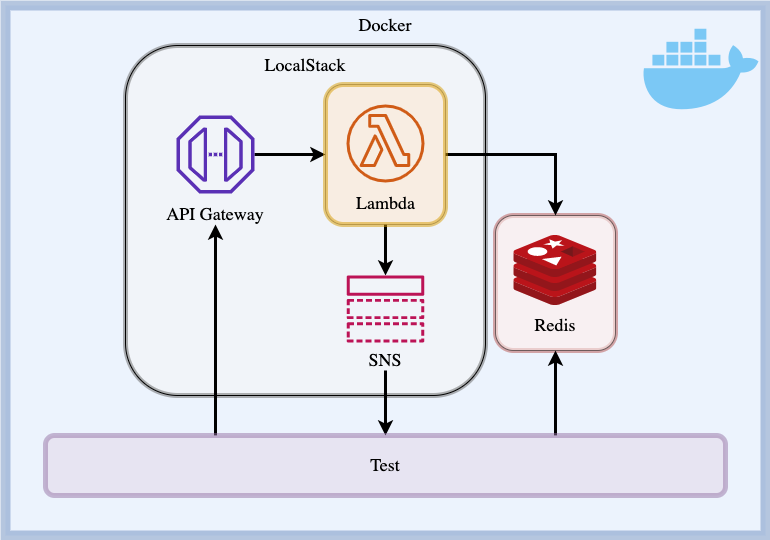
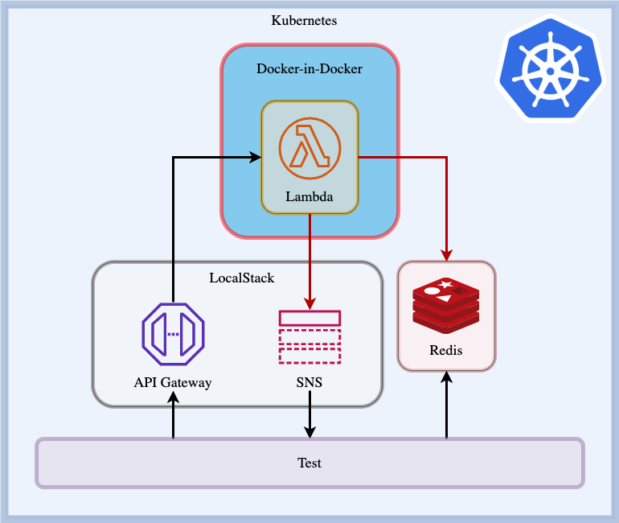

## First, some background...

For about a year now, I've been building services written in Golang that rely heavily on AWS Lambda functions. On the
whole, my experience has been very good: the services are cheap to run, they are performant, they scale and there's less
to worry about when it comes to things like keeping servers patched and secure.

There has always been one small problem: there didn't seem to be a way to adequately test the Lambda function locally.
Unit tests are one thing - and you can structure your code so that pretty much all of it is covered by unit
tests[^unit-tests] - but at some point, you actually have to run the program... and as far as I knew, the only way to do
that with Lambda functions was to actually deploy them to an AWS environment.

[^unit-tests]: **Unit tests** focus on individual methods within the application, testing them in isolation from other
    methods and mocking out any dependencies.

For example, let's take a simple Lambda function written in Golang. The functionality is simply to echo the received
request body back to the API Gateway, along with a `200` HTTP status code:

```go
package main

import (
	"github.com/aws/aws-lambda-go/events"
	"github.com/aws/aws-lambda-go/lambda"
	"net/http"
)

func Handler(req events.APIGatewayProxyRequest) (*events.APIGatewayProxyResponse, error) {
	return &events.APIGatewayProxyResponse{
		Body:       req.Body,
		StatusCode: http.StatusOK,
	}, nil
}

func main() {
	lambda.Start(Handler)
}
```

We can unit test the `Handler` function:

```go
package main

import (
	"github.com/aws/aws-lambda-go/events"
	"testing"
)

func TestHandler(t *testing.T) {
	t.Run(
		`given an APIGatewayProxyRequest with a Body of "foo"
        when Handler is called with the request
        then an APIGatewayProxyResponse with a Body of "foo" and a StatusCode of 200 is returned
            and there is no error`, func(t *testing.T) {
			// Given
			body := "foo"
			req := events.APIGatewayProxyRequest{
				Body: body,
			}

			// When
			res, err := Handler(req)

			// Then
			if err != nil {
				t.Error(err)
			}

			if res.Body != body {
				t.Errorf("got '%s', want '%s'", res.Body, body)
			}

			if res.StatusCode != http.StatusOK {
				t.Errorf("got '%d', want '%d'", res.StatusCode, http.StatusOK)
			}
		})
}
```

However, we cannot test the `main()` function in this way; the only way we can test `main()` is to perform a functional
test.[^functional-test]

[^functional-test]: **Functional tests** have no knowledge of the inner workings of the system they are testing; they
    feed input to the function and examine the output, confirming that it matches expectations.

A few weeks ago, we had a new colleague join the team and after he settled in, he started to ask some very pertinent
questions about my code, which in turn led me to question my assumption that I couldn't test this without deploying it
to AWS.

_This **must** be a common problem - there **has** to be a way to do this, right?_[^spoiler]

[^spoiler]: Spoiler alert: there is!

## The Lambda function and its context


The purpose of the Lambda function that I am looking to test is to handle data that is posted to an API Gateway
endpoint.[^api-gateway]

[^api-gateway]: The API Gateway invokes the Lambda function upon receiving a HTTP POST request.

The Lambda function does some transformation on the data; it then publishes the transformed data onto an SNS topic and
stores a record in an ElastiCache Redis data store.[^data-storage]

[^data-storage]: **SNS** stands for "Simple Notification Service"; it is a publish-subscribe messaging service.
    **Redis** is an in-memory data structure store; **ElastiCache** is AWS' service that provides it.

I've created a Lambda function that satisfies the requirements I've described
- [you can check out on GitHub](https://github.com/Marchie/localstack-api-gateway-lambda-sns-example). There is decent
unit test coverage, but these don't prove beyond doubt that the Lambda function works.

## What would a functional test look like?

Our functional test should treat our system as a "black-box".[^black-box] Our test should check the behaviours defined
in our requirements, which we could describe as follows:

[^black-box]: We have no visibility or knowledge of the internal workings or structures of a "black-box"; we can only
    test the behaviour that a black-box exhibits.

> _Given a correctly configured system,_
>
> _When a HTTP POST request is made to the endpoint,_
>
> _Then the body of the request is stored in the configured Redis cache_
>
> _and the key under which the body has been stored is published to the configured SNS topic._

So, our execution environment must provide a HTTP endpoint for our test to make a POST request to; it must be able to
invoke our Lambda function; it must give us a way for the test to access the message that is published to the SNS topic,
and it must allow the test to verify that the body of the POST request has been stored in the Redis cache.

### Enter: Docker and LocalStack

A few weeks ago, I came across [LocalStack](https://github.com/localstack/localstack). LocalStack is a fully functional
AWS cloud stack that you can run on your own machine. Under the hood, everything is running inside Docker
containers.[^docker]

[^docker]: [Docker](https://docker.com) is a way of running containerized applications: these are a bit like virtual
    machines, but without the overhead of having to run an operating system.

Most of the common AWS services are available in LocalStack and in our case, it provides much of the environment we need
for our functional test. We can set up an API Gateway to provide a HTTP endpoint we can send POST requests to; we can
configure this API Gateway to trigger our Lambda function whenever it receives a HTTP request; and we can create an SNS
topic for the Lambda function to publish messages to. The only thing we can't do in the community edition of LocalStack
is provide an ElastiCache Redis store.[^localstack-pro] However, since this is all Docker under the hood, we can spin up
Redis in a separate Docker container.

[^localstack-pro]: ElastiCache _is_ available in the [LocalStack Pro edition](https://localstack.cloud/), however I've
    not used this service.

Our functional test first needs to set up the environment so that the system we're testing is configured and available.
Then, the test needs to set up a HTTP endpoint of its own and subscribe to the same SNS topic that the Lambda will
publish messages to. With that subscription in place, we can begin the actual test: we send a HTTP POST request with a
known body to the API Gateway endpoint. The system we are testing will do its thing. If all is well, our test will
receive a message on its HTTP endpoint; that message will contain the key under which the data is stored in Redis. Our
test can then connect to the Redis cache and confirm that the value held under that key matches the body of the request
we sent to the API Gateway endpoint.

## Testing it out with Docker Compose



[Docker Compose](https://docs.docker.com/compose/) is a tool for defining and running multi-container applications. We
can use a _docker-compose.yml_ file to set up and execute our test:

```yaml
version: '3.8'

services:
  localstack:
    image: localstack/localstack:latest
    networks:
      - testnet
    environment:
      SERVICES: apigateway,lambda,sns
      DEBUG: 0
      LAMBDA_EXECUTOR: docker
      LAMBDA_DOCKER_NETWORK: localstack-api-gateway-lambda-sns-example_testnet
    volumes:
      - /var/run/docker.sock:/var/run/docker.sock
      - localstack_tmp:/tmp/localstack

  redis:
    image: redis:alpine
    networks:
      - testnet

  build_and_test:
    image: golang:alpine
    networks:
      - testnet
    environment:
      # Go environment
      GOOS: linux
      GOARCH: amd64
      CGO_ENABLED: 0
      # App environment
      AWS_ENDPOINT: http://localstack:4566
      AWS_REGION: us-east-1
      AWS_ACCESS_KEY_ID: test
      AWS_SECRET_ACCESS_KEY: test
      REDIS_SERVER_ADDRESS: redis:6379
      SNS_TOPIC_ARN: will_be_overwritten_by_functional_test
      # Test environment
      TEST_AWS_ENDPOINT: http://localstack:4566
      TEST_REDIS_SERVER_ADDRESS: redis:6379
      TEST_SNS_TOPIC_CONSUMER_ENDPOINT: http://build_and_test:8080
      TEST_LAMBDA_FUNCTION_CODE_PATH: ../builds/app.zip
      TEST_LAMBDA_FUNCTION_NAME: app
      TEST_LAMBDA_HANDLER: app
    volumes:
      - ./:/src
    command: >
      sh -c "apk add git zip &&
        cd /src &&
        go test -v -timeout="15s" ./... &&
        rm -rf ./builds &&
        mkdir -p ./builds &&
        go build -o ./builds/app -ldflags=\"-s -w\" main.go &&
        zip -j ./builds/app.zip ./builds/app &&
        go test -v --tags=\"integration\" -run TestAppIntegration ./app/..."

networks:
  testnet:
    driver: bridge

volumes:
  localstack_tmp:
```

Let's break this down piece-by-piece.

### LocalStack service

We define the setup of our different containers under the **services** object. The first service we have listed is
LocalStack:

```yaml
  localstack:
    image: localstack/localstack:latest
    networks:
      - testnet
    environment:
      SERVICES: apigateway,lambda,sns
      DEBUG: 0
      LAMBDA_EXECUTOR: docker
      LAMBDA_DOCKER_NETWORK: localstack-api-gateway-lambda-sns-example_testnet
    volumes:
      - /var/run/docker.sock:/var/run/docker.sock
      - localstack_tmp:/tmp/localstack
```

Let's take a look at what goes into defining this service.

```yaml
  localstack:
```

First up, we have the name of our service - in this case, it's **localstack**. The service is defined as an object in
the
_docker-compose.yml_ file.

```yaml
    image: localstack/localstack:latest
```

For each service, we specify an image.[^docker-image] We are using images that are maintained by the Docker community
for all of our services; they are publicly available on [Docker Hub](https://hub.docker.com).

[^docker-image]: A Docker image contains all the information needed to run a containerised application.

When we bring up the Docker Compose environment, these images will be downloaded from the Docker Hub, a container will
be built from the image and the container will be started up.

```yaml
  networks:
    - testnet
```

Next up, we have the networks array.[^docker-network] We specify the network as `testnet`, which is a reference to a
network that we define later on in the `docker-compose.yml` file:

[^docker-network]: A Docker network provides a mechanism for Docker containers to communicate with each other.

```yaml
networks:
  testnet:
    driver: bridge
```

We will attach all of our containers to the `testnet` network so that they can all communicate with each other. Note
that we have set the driver to `bridge`: Docker provides an in-built DNS service for custom bridge networks, which
enables the different containers to communicate with each other by their name.

```yaml
    environment:
      SERVICES: apigateway,lambda,sns
      DEBUG: 0
      LAMBDA_EXECUTOR: docker
      LAMBDA_DOCKER_NETWORK: localstack-api-gateway-lambda-sns-example_testnet
```

The environment object contains a map of environment variable keys and values, which are then set in the container
environment.

We set up four environment variables for LocalStack:

```yaml
      SERVICES: apigateway,lambda,sns
```

**SERVICES** contains a comma-separated list of the AWS services we want LocalStack to run.

```yaml
      DEBUG: 0
```

With **DEBUG** set to `0`, LocalStack won't output debug level logs. If you're having problems getting things working,
it can be useful to set this value to `1` and gain some additional insight into what's happening within LocalStack.

```yaml
      LAMBDA_EXECUTOR: docker
```

**LAMBDA_EXECUTOR** specifies the way that LocalStack should execute Lambda functions. For Lambda functions written in
Golang, this value **must** be set to `docker`. This setting means that LocalStack creates a new Docker container each
time a Lambda function is invoked; the Lambda code is then executed inside that container and then the container is
destroyed.

```yaml
      LAMBDA_DOCKER_NETWORK: localstack-api-gateway-lambda-sns-example_testnet
```

Finally, we have the **LAMBDA\_DOCKER\_NETWORK** variable, which we've set
to `localstack-api-gateway-lambda-sns-example_testnet`. This value is particularly important for our functional test,
because we need our Lambda function to be able to communicate with our Redis container, which sits outside of
LocalStack. This setting means that when LocalStack creates a container for a Lambda function, it attaches that
container to our Docker network.

This bit was initially a point of confusion for me; why isn't this value just `testnet` like we've specified for our
different containers? Well, it turns out that networks defined in _docker-compose.yml_ are given a name based on the
"project name", which is in turn based on the name of the directory where the _docker-compose.yml_ is
located.[^docker-compose-project-name]

[^docker-compose-project-name]: The "project name" can be overridden; see the
    [Docker Compose Networking documentation](https://docs.docker.com/compose/networking/).

```yaml
    volumes:
      - /var/run/docker.sock:/var/run/docker.sock
      - localstack_tmp:/tmp/localstack
```

The last key in our LocalStack service definition is the **volumes** array.[^docker-volumes] Here, we map the
`docker.sock` from our host machine onto the `/var/run/docker.sock` in the LocalStack container. LocalStack uses the
Docker daemon from our host machine to create the container when a Lambda function is invoked.

[^docker-volumes]: A Docker volume is a method for giving a container access to a disk location on the host machine.

We also map a temporary volume onto `/tmp/localstack` in the LocalStack container; this temporary volume is defined
later in the _docker-compose.yml_ file:

```yaml
volumes:
  localstack_tmp:
```

The temporary volume will be destroyed when Docker Compose exits.

### Redis service

Onto our next service - our Redis container:

```yaml
  redis:
    image: redis:alpine
    networks:
      - testnet
```

This is really simple - we're creating a container from the Redis image from Docker Hub and we're attaching the
container to our `testnet` network.[^alpine-linux]

[^alpine-linux]: We have specified the [Alpine Linux](https://alpinelinux.org/) version of the Redis image. Alpine Linux
    is a security-oriented, lightweight Linux distribution. Docker images based on Alpine Linux lack certain features, but
    are typically much smaller in size than the standard images.

### Build and test service

Our final service:

1. Runs our unit tests;
2. Builds the executable binary;
3. Adds the binary to a Zip archive; and
4. Runs the functional test.

```yaml
  build_and_test:
    image: golang:alpine
    networks:
      - testnet
    environment:
      # Go environment
      GOOS: linux
      GOARCH: amd64
      CGO_ENABLED: 0
      # App environment
      AWS_ENDPOINT: http://localstack:4566
      AWS_REGION: us-east-1
      AWS_ACCESS_KEY_ID: test
      AWS_SECRET_ACCESS_KEY: test
      REDIS_SERVER_ADDRESS: redis:6379
      SNS_TOPIC_ARN: will_be_overwritten_by_functional_test
      # Test environment
      TEST_LOCALSTACK_ENDPOINT: http://localstack:4566
      TEST_REDIS_SERVER_ADDRESS: redis:6379
      TEST_SNS_TOPIC_CONSUMER_ENDPOINT: http://build_and_test:8080
      TEST_LAMBDA_FUNCTION_CODE_PATH: ../builds/app.zip
      TEST_LAMBDA_HANDLER: app
    volumes:
      - ./:/src
    command: >
      sh -c "apk add git zip &&
        cd /src &&
        go test -v -timeout="15s" ./... &&
        rm -rf ./builds &&
        mkdir -p ./builds &&
        go build -o ./builds/app -ldflags=\"-s -w\" main.go &&
        zip -j ./builds/app.zip ./builds/app &&
        go test -v --tags=\"integration\" -run TestAppIntegration ./app/..."
```

We're doing some similar things to before; we're using the Alpine Linux version of the Golang image and we're attaching
the container to our `testnet` network.

There are many more environment variables defined for this container.

First up, we have variables that relate to our Golang build environment:

```yaml
      GOOS: linux
      GOARCH: amd64
      CGO_ENABLED: 0
```

Golang's `go build` command does different things depending on operating system and processor architecture that it's
building for. We need to set these values to the appropriate values for the AWS Lambda
environment.[^aws-go-lambda-deployment-package]

[^aws-go-lambda-deployment-package]: See the 
    [AWS Lambda deployment package in Go documentation](https://docs.aws.amazon.com/lambda/latest/dg/golang-package.html)
    for more information.

Next, we have our app environment, which contains values that will be set for our application when it gets executed as a
Lambda function:

```yaml
      AWS_ENDPOINT: http://localstack:4566
      AWS_REGION: us-east-1
      AWS_ACCESS_KEY_ID: test
      AWS_SECRET_ACCESS_KEY: test
      REDIS_SERVER_ADDRESS: redis:6379
      SNS_TOPIC_ARN: will_be_overwritten_by_functional_test
```

We set the **AWS\_ENDPOINT** value to the HTTP endpoint for our LocalStack container. This customises the configuration
used in the AWS SDK functions so that they communicate to our test environment, rather than trying to communicate with
live AWS services.

The **AWS\_REGION** value is set to `us-east-1` - this is the default value used in the LocalStack environment. This
value needs to match with whatever the region is set to in LocalStack.

**AWS\_ACCESS\_KEY\_ID** and **AWS\_SECRET\_ACCESS\_KEY** aren't actually used to authenticate against services like
they would be in a live AWS environment, so we can use dummy values for these. However, we need to provide them because
the AWS SDK expects them to be there and will error if they aren't present.

Now, we move onto the configuration for our own code!

```yaml
      REDIS_SERVER_ADDRESS: redis:6379
      SNS_TOPIC_ARN: will_be_overwritten_by_functional_test
```

The **REDIS\_SERVER\_ADDRESS** is set to `redis:6379` - remember that Docker will provide a DNS service that translates
the service name to an IP address.

We set the **SNS\_TOPIC\_ARN** to an arbitrary value.[^arn] In the live environment, the SNS topic will already exist,
so we will be able to provide the ARN in the environment. However, with our functional test, the environment gets set up
as part of the test and we don't know what the ARN will be until it has been set up. So, we overwrite this value in our
test setup code once the SNS topic has been created.

[^arn]: **ARN** stands for "Amazon Resource Name". They uniquely identify resources on AWS.

Finally, we have our test environment, which contains values that we use within our functional test:

```yaml
      TEST_LOCALSTACK_ENDPOINT: http://localstack:4566
      TEST_REDIS_SERVER_ADDRESS: redis:6379
      TEST_SNS_TOPIC_CONSUMER_ENDPOINT: http://build_and_test:8080
      TEST_LAMBDA_FUNCTION_CODE_PATH: ../builds/app.zip
      TEST_LAMBDA_HANDLER: app
```

The **TEST\_AWS\_ENDPOINT** is set to `http://localstack:4566`. Our test will use this value to communicate with
LocalStack, which it will do when setting up the API Gateway, Lambda and SNS services for our
test.[^localstack-edge-service]

[^localstack-edge-service]: Before **v0.11.0**, LocalStack made its different AWS services on different ports; for
    example, API Gateway ran on port _4567_, Lambda ran on _4574_, SNS on _4575_, etc. Since **v0.11.0**, LocalStack employs
    an edge service; this accepts traffic through a single port - _4566_ - and routes it internally as appropriate.

The **TEST\_REDIS\_SERVER\_ADDRESS** is set to `redis:6379`. Our test will query this Redis service to check that the
data stored matches the body of the request we send to the API Gateway.

The **TEST\_SNS\_TOPIC\_CONSUMER\_ENDPOINT** is set to `http://build_and_test:8080`. This is the name of the container
running our test, plus an arbitrary port. The test will create a HTTP server running on this port, which will receive
messages that are published to the SNS topic.

**TEST\_LAMBDA\_FUNCTION\_CODE\_PATH** defines the path to the code we're going to deploy to LocalStack. Lambda expects
this code to be contained in a Zip archive. The code will be uploaded to the LocalStack service as part of the test
setup, so the path is **relative to the test file**.

Finally, the **TEST\_LAMBDA\_HANDLER** refers to the name of the function contained within the Zip file.[^command-note]

[^command-note]: The **TEST\_LAMBDA\_FUNCTION\_CODE\_PATH** and **TEST\_LAMBDA\_HANDLER** values depend on what we
    specify in the command that we're going to execute on our container - we'll get to that shortly.

We now define our **volumes**:

```yaml
volumes:
  - ./:/src
```

This mounts the directory containing the _docker-compose.yml_ file to the `/src` path on the container. We can use this
mapping to access our source code from the container.

Finally, we run a command on the container:

```yaml
command: >
  sh -c "apk add git zip &&
    cd /src &&
    go test -v -timeout="15s" ./... &&
    rm -rf ./builds &&
    mkdir -p ./builds &&
    go build -o ./builds/app -ldflags=\"-s -w\" main.go &&
    zip -j ./builds/app.zip ./builds/app &&
    go test -v --tags=\"integration\" -run TestAppIntegration ./app/..."
```

We're chaining a few things together in our command.

Firstly, we're installing the `git` and `zip` packages on the container - Alpine Linux is very minimal, so these aren't
included as part of the base image.

Next, we change the directory to `/src`, which contains the code that we're going to build, deploy and test.

We run our unit tests. Our unit tests should execute very quickly - and if a unit test fails, there's no point
continuing with our pipeline.[^fail-fast]

[^fail-fast]: The principle here is to **fail fast**. Where possible, we should only execute the more resource-intensive
    steps after the fast-running, "cheap" steps have successfully completed.

Then, we clear out any old build (if it exists) and create a build directory. We then build the application using
the `go build`
command, specifying a custom output location with the `-o` flag. (We're naming our binary as `app` here - this so this
is the value we use for **TEST\_LAMBDA\_HANDLER** in our test environment.)

Now, we zip up our binary so that it can be deployed as a Lambda. (The name we use for the archive relates to the value
we use in the **TEST\_LAMBDA\_FUNCTION\_CODE\_PATH**.)

Finally, we run our functional test![^build-tag]

[^build-tag]: Note that we've added the "integration" build tag to our integration test files.

### Running the test with Docker Compose

To run the test with Docker Compose, use the following command:

```none
docker-compose up --build --abort-on-container-exit
```

This will spin up the services defined in the _docker-compose.yml_ file and execute the functional test. The `--build`
option ensures that the image gets rebuilt whenever we run the test; this means any changes we've made to our code will
be reflected in the test that we're running. The `--abort-on-container-exit` option makes Docker Compose exit when any
of the containers exit and return the exit code; without this flag, the test process would run indefinitely.

If the test passes, you should see output similar to the following in your console:

```none
build_and_test_1  | --- PASS: TestAppIntegration (6.02s)
build_and_test_1  |     --- PASS: TestAppIntegration/given_a_configured_stack_when_a_message_is_posted_to_the_API_Gateway_endpoint_then_the_message_body_is_stored_in_the_configured_Redis_cache_and_the_key_under_which_the_message_has_been_stored_is_published_to_an_SNS_topic (6.02s)
build_and_test_1  | PASS
build_and_test_1  | ok          github.com/Marchie/localstack-api-gateway-lambda-sns-example/app        6.031s
localstack-api-gateway-lambda-sns-example_build_and_test_1 exited with code 0
```

Don't worry too much if you see some warnings from LocalStack similar to this:

```none
localstack_1      | 2020-11-29T03:07:32:WARNING:localstack.utils.server.http2_server: Error in proxy handler for request GET http://localstack:4566/2015-03-31/functions/: Unable to find listener for service "lambda" - please make sure to include it in $SERVICES Traceback (most recent call last):
```

This happens because there only way to tell whether the LocalStack services are available is to try and use
them.[^depends-on]
Our test runs a "list" type command in a loop against each service to see if it is available: if the command is
successful, we know the service is available and we can proceed further with our test. However, if the service is not
yet available, LocalStack will log a warning.

[^depends-on]: Docker Compose does have the [depends_on](https://docs.docker.com/compose/compose-file/#depends_on)
    array, however this only checks that the containers we're depending on have **started** - it doesn't check that the
    services running in those containers are **ready**.

## Using this in a Drone build pipeline

Being able to run tests on your local machine is useful for when developing your application. However, we will normally
want to run all of our tests as part of a continuous integration/continuous delivery pipeline. Where I work, we use
[Drone](https://drone.io) for this.

Drone pipelines are configured with a YAML configuration file, normally named _.drone.yml_, which is included in the
same repository as your application code.[^config-as-code] Drone's YAML configuration file is a superset of Docker
Compose: Drone pipelines are executed inside Docker containers.

[^config-as-code]: This practice is known as "configuration as code".

Here is a _.drone.yml_ file which performs all of the functions in the _docker-compose.yml_ described above:

```yaml
kind: pipeline
name: default
type: docker

platform:
  os: linux
  arch: amd64

services:
  - name: localstack
    image: localstack/localstack:latest
    environment:
      SERVICES: apigateway,lambda,sns
      DEBUG: 0
      LAMBDA_EXECUTOR: docker
      LAMBDA_DOCKER_NETWORK: $DRONE_DOCKER_NETWORK_ID
    volumes:
      - name: dockersock
        path: /var/run/docker.sock
      - name: tempdir
        path: /tmp/localstack

  - name: redis
    image: redis:alpine

steps:
  - name: unit_tests
    image: golang
    environment:
      GOOS: linux
      GOARCH: amd64
      CGO_ENABLED: 1
    volumes:
      - name: godeps
        path: /go
    commands:
      - go test -timeout=15s -race ./...

  - name: build
    image: golang
    environment:
      GOOS: linux
      GOARCH: amd64
      CGO_ENABLED: 0
    volumes:
      - name: godeps
        path: /go
    commands:
      - rm -rf ./builds
      - mkdir -p ./builds
      - go build -o ./builds/app -ldflags="-s -w" main.go

  - name: create_lambda_deployment_package
    image: alpine
    commands:
      - apk add --no-cache zip
      - zip -j ./builds/app.zip ./builds/app

  - name: integration_test
    image: golang
    environment:
      GOOS: linux
      GOARCH: amd64
      CGO_ENABLED: 0
      # App environment
      AWS_ENDPOINT: http://localstack:4566
      AWS_REGION: us-east-1
      AWS_ACCESS_KEY_ID: test
      AWS_SECRET_ACCESS_KEY: test
      REDIS_SERVER_ADDRESS: redis:6379
      SNS_TOPIC_ARN: will_be_overwritten_by_functional_test
      # Test environment
      TEST_AWS_ENDPOINT: http://localstack:4566
      TEST_REDIS_SERVER_ADDRESS: redis:6379
      TEST_SNS_TOPIC_CONSUMER_ENDPOINT: http://integration_test:8080
      TEST_LAMBDA_FUNCTION_CODE_PATH: ../builds/app.zip
      TEST_LAMBDA_HANDLER: app
    volumes:
      - name: godeps
        path: /go
    commands:
      - go test -v --tags="integration" -run TestAppIntegration ./app/.

volumes:
  - name: dockersock
    host:
      path: /var/run/docker.sock
  - name: tempdir
    temp: { }
  - name: godeps
    temp: { }
```

We're not using all of the options available in Drone - you can check out
the [Drone YAML documentation](https://docs.drone.io/yaml/docker/)
to find out about all of the available options and values.

Let's break our pipeline down...

### Kind, name and type

This is the basic information about the pipeline:

```yaml
kind: pipeline
name: default
type: docker
```

The **kind** value must be `pipeline`, the **name** is an arbitrary name for the pipeline. The **type** value indicates
how the pipeline is implemented. In this case, we're running the pipeline in a Docker environment, so we set this
to `docker`.[^kubernetes]

[^kubernetes]: We'll see an example of a Kubernetes pipeline later.

### Platform

```yaml
platform:
  os: linux
  arch: amd64
```

The **platform** describes the target operating system and architecture upon which the pipeline is going to run.

### Services

Drone supports the use of detached service containers as part of a pipeline. These are containers that start running
when a pipeline is executed and stay running for the duration of the execution. They are used to support steps within
the pipeline. In our case, we need LocalStack and Redis to support our integration test, so we define those in the
**services** array within our _.drone.yml_:

```yaml
services:
  - name: localstack
    image: localstack/localstack:latest
    environment:
      SERVICES: apigateway,lambda,sns
      DEBUG: 0
      LAMBDA_EXECUTOR: docker
      LAMBDA_DOCKER_NETWORK: $DRONE_DOCKER_NETWORK_ID
    volumes:
      - name: dockersock
        path: /var/run/docker.sock
      - name: tempdir
        path: /tmp/localstack

  - name: redis
    image: redis:alpine
```

You can see that the definition of the **services** is very similar to what we have already seen earlier in our _
docker-compose.yml_ file.

One key difference to point out is the value for **LAMBDA\_DOCKER\_NETWORK**, which we have set to
`$DRONE_DOCKER_NETWORK_ID`. Drone creates a new Docker network with a random name each time the pipeline is
executed;[^drone-network-id]
the name of this network is stored in the `DRONE_DOCKER_NETWORK_ID` environment variable, which is available to the
process that parses our _.drone.yml_ file. By defining **LAMBDA\_DOCKER\_NETWORK** as `$DRONE_DOCKER_NETWORK_ID`,
Drone's YAML parser will substitute in the Docker network name from the environment, and our Lambda can communicate with
our other containers.

[^drone-network-id]: This is different from the case we saw in our _docker-compose.yml_ file, where we defined the
    Docker network within the _docker-compose.yml_ file and therefore knew what its name would be in advance.

Another difference is how volumes are mapped to containers, which we'll look at now:

### Volumes

The root level **volumes** array is defined a little differently from _docker-compose.yml_:

```yaml
volumes:
  - name: dockersock
    host:
      path: /var/run/docker.sock
  - name: tempdir
    temp: { }
  - name: godeps
    temp: { }
```

There are two types of volume available - **host**, which maps to a physical location on the host machine, and **temp**,
which is not mapped to a volume on the host machine. Both types of volume are defined with a **name**, which can be
referred to by containers in services and steps.

Volumes on containers are defined with a different syntax to _docker-compose.yml_ too:

```yaml
    volumes:
      - name: dockersock
        path: /var/run/docker.sock
      - name: tempdir
        path: /tmp/localstack
```

Each volume has a **name** and a **path**. The **name** is a reference to the name of volume defined in the root level
**volumes** array, and the **path** is where the volume will be mounted on the container.

### Steps

The **steps** array is where the main action is in the pipeline. We define a step for each action that we want to take;
if any step returns a non-zero exit code, the pipeline execution is halted.

Drone has a couple of features which makes it easy for us to split out the commands that were executed on a single
container in our _docker-compose.yml_ into separate steps. Firstly, Drone executes steps sequentially by default, so the
next step will only start after the previous one has finished. Secondly, each Drone step has a shared "workspace"
volume, which is automatically mounted to _/drone/src_ on each container and then set as the current working directory.
This means that we can create something stateful in one step and it will be available for future steps to
use.[^shared-state]

[^shared-state]: While the containers share a working directory, they do not share any other state by default; so,
    things like package installs and downloaded Go modules are not shared between builds without further configuration.
    We'll address this in due course!

We will use this to our advantage to split our ugly chained build and test command up into distinct stages:

1. Unit tests;
2. Compile packages and dependencies into an executable binary;
3. Create a Zip archive containing the executable binary; and
4. The integration test.

```yaml
steps:
  - name: unit_tests
    image: golang
    environment:
      GOOS: linux
      GOARCH: amd64
      CGO_ENABLED: 1
    volumes:
      - name: godeps
        path: /go
    commands:
      - go test -timeout=15s -race ./...

  - name: build
    image: golang
    environment:
      GOOS: linux
      GOARCH: amd64
      CGO_ENABLED: 0
    volumes:
      - name: godeps
        path: /go
    commands:
      - rm -rf ./builds
      - mkdir -p ./builds
      - go build -o ./builds/app -ldflags="-s -w" main.go

  - name: create_lambda_deployment_package
    image: alpine
    commands:
      - apk add --no-cache zip
      - zip -j ./builds/app.zip ./builds/app

  - name: integration_test
    image: golang
    environment:
      GOOS: linux
      GOARCH: amd64
      CGO_ENABLED: 0
      # App environment
      AWS_ENDPOINT: http://localstack:4566
      AWS_REGION: us-east-1
      AWS_ACCESS_KEY_ID: test
      AWS_SECRET_ACCESS_KEY: test
      REDIS_SERVER_ADDRESS: redis:6379
      SNS_TOPIC_ARN: will_be_overwritten_by_functional_test
      # Test environment
      TEST_AWS_ENDPOINT: http://localstack:4566
      TEST_REDIS_SERVER_ADDRESS: redis:6379
      TEST_SNS_TOPIC_CONSUMER_ENDPOINT: http://integration_test:8080
      TEST_LAMBDA_FUNCTION_CODE_PATH: ../builds/app.zip
      TEST_LAMBDA_HANDLER: app
    volumes:
      - name: godeps
        path: /go
    commands:
      - go test -v --tags="integration" -run TestAppIntegration ./app/.
```

Each step contains one or more **commands**, which are executed sequentially on that step's container.

Let's tackle our steps one-by-one.

### Unit tests

```yaml
  - name: unit_tests
    image: golang
    environment:
      GOOS: linux
      GOARCH: amd64
      CGO_ENABLED: 1
    volumes:
      - name: godeps
        path: /go
    commands:
      - go test -timeout=15s -race ./...
```

As before, we run our unit tests first of all. There are two differences introduced in this step that are worth
highlighting.

The first thing to note is that we have attached a temporary volume to the `/go` path on the container. We will attach
this volume to later steps. This action allows the dependencies downloaded in each step to be available to the steps
that follow - the future steps can then access dependencies from a local cache, rather than each step downloading the
same dependency over and again.

The second difference is that we have set the **CGO_ENABLED** variable to `1` in this step, whereas previously we had
set that value to `0`. We've changed that setting for this step so that we can use the
[Go race detector](https://blog.golang.org/race-detector) with our unit tests.[^go-race-detector]

[^go-race-detector]: The Go race detector is enabled by passing the _-race_ flag in the **go test** command.

### Build

This step clears out any old builds (should they exist) by recreating the `./builds` directory; we then create a
production-ready build of our Go application, using the settings required for the AWS Lambda execution environment.

```yaml
  - name: build
    image: golang
    environment:
      GOOS: linux
      GOARCH: amd64
      CGO_ENABLED: 0
    volumes:
      - name: godeps
        path: /go
    commands:
      - rm -rf ./builds
      - mkdir -p ./builds
      - go build -o ./builds/app -ldflags="-s -w" main.go
```

### Create Lambda deployment package

For Lambda functions written in Golang, the Lambda deployment package is just the executable binary contained in a Zip
archive. We do that with a container running Alpine Linux:

```yaml
  - name: create_lambda_deployment_package
    image: alpine
    commands:
      - apk add --no-cache zip
      - zip -j ./builds/app.zip ./builds/app
```

### Integration test

Finally, much like before, we run our integration test:

```yaml
  - name: integration_test
    image: golang
    environment:
      GOOS: linux
      GOARCH: amd64
      CGO_ENABLED: 0
      # App environment
      AWS_ENDPOINT: http://localstack:4566
      AWS_REGION: us-east-1
      AWS_ACCESS_KEY_ID: test
      AWS_SECRET_ACCESS_KEY: test
      REDIS_SERVER_ADDRESS: redis:6379
      SNS_TOPIC_ARN: will_be_overwritten_by_functional_test
      # Test environment
      TEST_AWS_ENDPOINT: http://localstack:4566
      TEST_REDIS_SERVER_ADDRESS: redis:6379
      TEST_SNS_TOPIC_CONSUMER_ENDPOINT: http://integration_test:8080
      TEST_LAMBDA_FUNCTION_CODE_PATH: ../builds/app.zip
      TEST_LAMBDA_HANDLER: app
    volumes:
      - name: godeps
        path: /go
    commands:
      - go test -v --tags="integration" -run TestAppIntegration ./app/.
```

## Executing a Drone pipeline on your own machine

You can execute Drone pipelines on your own machine by installing the
[Drone command-line interface](https://docs.drone.io/cli/install/).[^delete-docker-compose]

[^delete-docker-compose]: If you've been following along and you've created a _docker-compose.yml_, you can delete it
    now. Sorry!

Execute the pipeline using this command:

```none
drone exec --trusted .drone.yml
```

As before, a zero exit code indicates that everything is OK; a non-zero exit code signifies a failure.

## Making this work with Drone on Kubernetes

Having got this Drone pipeline working locally, I was as giddy as a kipper![^giddy-as-a-kipper]

[^giddy-as-a-kipper]: This is a local term for "very excited". Apologies if you are not from north-west England!

However, my excitement was short-lived. When I pushed my branch up to our Git repository and the build ran on our Drone
server, it just sat there... not failing, not passing, just spinning about aimlessly doing nothing at all.

I spoke with one of our DevOps guys - our Drone server is running on Kubernetes, not Docker; the pipeline type needs to
be set to `kubernetes`:

```diff
 kind: pipeline
 name: default
-type: docker
+type: kubernetes
```

...and so begins another chapter to this story!

### Kubernetes _.drone.yml_

Here's the differences between our _.drone.yml_ for Docker and the _.drone.yml_ for Kubernetes:

```diff
 kind: pipeline
 name: default
-type: docker
+type: kubernetes
 
 platform:
   os: linux
   arch: amd64
 
 services:
+  - name: docker
+    image: docker:dind
+    network_mode: host
+    privileged: true
+    volumes:
+      - name: dockersock
+        path: /var/run
+      - name: tempdir
+        path: /tmp
+
   - name: localstack
     image: localstack/localstack:latest
     environment:
       SERVICES: apigateway,lambda,sns
       DEBUG: 0
       LAMBDA_EXECUTOR: docker
-      LAMBDA_DOCKER_NETWORK: $DRONE_DOCKER_NETWORK_ID
     volumes:
       - name: dockersock
-        path: /var/run/docker.sock
+        path: /var/run
       - name: tempdir
-        path: /tmp/localstack
+        path: /tmp
 
   - name: redis
     image: redis:alpine
 
 steps:
   - name: unit_tests
     image: golang
     environment:
       GOOS: linux
       GOARCH: amd64
       CGO_ENABLED: 1
     volumes:
       - name: godeps
         path: /go
     commands:
       - go test -timeout=15s -race ./...
 
   - name: build
     image: golang
     environment:
       GOOS: linux
       GOARCH: amd64
       CGO_ENABLED: 0
     volumes:
       - name: godeps
         path: /go
     commands:
       - rm -rf ./builds
       - mkdir -p ./builds
       - go build -o ./builds/app -ldflags="-s -w" main.go
 
   - name: create_lambda_deployment_package
     image: alpine
     commands:
       - apk add --no-cache zip
       - zip -j ./builds/app.zip ./builds/app
 
   - name: integration_test
     image: golang
     environment:
       GOOS: linux
       GOARCH: amd64
       CGO_ENABLED: 0
       # App environment
-      AWS_ENDPOINT: http://localstack:4566
+      AWS_ENDPOINT: :4566
       AWS_REGION: us-east-1
       AWS_ACCESS_KEY_ID: test
       AWS_SECRET_ACCESS_KEY: test
-      REDIS_SERVER_ADDRESS: redis:6379
+      REDIS_SERVER_ADDRESS: :6379
       SNS_TOPIC_ARN: will_be_overwritten_by_functional_test
       # Test environment
-      TEST_AWS_ENDPOINT: http://localstack:4566
-      TEST_REDIS_SERVER_ADDRESS: redis:6379
-      TEST_SNS_TOPIC_CONSUMER_ENDPOINT: http://integration_test:8080
+      TEST_AWS_ENDPOINT: http://localhost:4566
+      TEST_REDIS_SERVER_ADDRESS: localhost:6379
+      TEST_SNS_TOPIC_CONSUMER_ENDPOINT: http://localhost:8080
       TEST_LAMBDA_FUNCTION_CODE_PATH: ../builds/app.zip
       TEST_LAMBDA_HANDLER: app
     volumes:
       - name: godeps
         path: /go
     commands:
+      - export KUBERNETES_POD_IP=$(hostname -i)
       - go test -v --tags="integration" -run TestAppIntegration ./app/.
 
 volumes:
   - name: dockersock
-    host:
-      path: /var/run/docker.sock
+    temp: {}
   - name: tempdir
     temp: {}
   - name: godeps
     temp: {}
```

Let's explore the reasons behind these changes.

### Challenge #1: **docker.sock**

The first challenge presented by the switch to a Kubernetes pipeline runner is that we no longer have the host's
`docker.sock` available to us. This is problematic for our LocalStack setup, because our Lambda function runs in a
Docker container.

The solution to this is to introduce a new service to our pipeline: **Docker-in-Docker**:

```yaml
  - name: docker
    image: docker:dind
    privileged: true
    network_mode: host
    volumes:
      - name: dockersock
        path: /var/run
      - name: tempdir
        path: /tmp
```

**Docker-in-Docker**, or _docker:dind_, involves running a Docker container inside another container. We can use this
Docker-in-Docker service to provide the `docker.sock` LocalStack needs to execute our Lambda function.[^privileged-mode]

[^privileged-mode]: Your build pipeline will need to be set as **trusted** by your Drone administrator to
    enable this functionality.

In order for LocalStack to be able to access Docker-in-Docker's `docker.sock`, it needs to be mounted on a volume that
both containers can access. So, rather than creating a host volume mapped to `/var/run/docker.sock`, we instead create a
temporary volume that maps to the `/var/run` path on both the Docker-in-Docker and LocalStack containers.

```yaml
volumes:
  - name: dockersock
    temp: {}
```

When the Docker-in-Docker container starts, it will create its `docker.sock` in this temporary volume, from where the
LocalStack container can access it.

```yaml
  - name: localstack
    image: localstack/localstack:latest
    environment:
      SERVICES: apigateway,lambda,sns
      DEBUG: 0
      LAMBDA_EXECUTOR: docker
    volumes:
      - name: dockersock
        path: /var/run
      - name: tempdir
        path: /tmp
```

### Challenge #2: **Networking**

Our pipeline will be running in a single Kubernetes pod.[^pod] This means we no longer have Docker's DNS service to
facilitate communication between our containers; we can no longer refer to the name of a container in our application
configuration.

[^pod]: A [pod](https://kubernetes.io/docs/concepts/workloads/pods/) is a group of one or more containers, with shared
    storage/network resources, and a specification for how to run the containers.

Containers in a Kubernetes pod can communicate with each other using **localhost**. This makes our test environment a
little less easy to read...

```yaml
       # Test environment
       TEST_AWS_ENDPOINT: http://localhost:4566
       TEST_REDIS_SERVER_ADDRESS: localhost:6379
       TEST_SNS_TOPIC_CONSUMER_ENDPOINT: http://localhost:8080
```

...but that's the least of our worries!

We face a much greater problem when it comes to getting our Lambda function to talk to LocalStack and our integration
test endpoint.

Our Lambda function is going to run in a Docker environment, whereas all of the other containers in our pipeline are
running in a Kubernetes environment. **localhost** in the Docker environment does not map to **localhost** in the
Kubernetes environment - even though Docker is running inside Kubernetes, they are in effect completely separate
networks.[^lambda-docker-network]

[^lambda-docker-network]: You might have noticed that we've dropped the **LAMBDA\_DOCKER\_NETWORK** variable from our
    LocalStack environment - it's no use to us here!



The only way I've found to get the Lambda to be able to communicate with the other containers is through using the pod's
IP address. Unfortunately, the pod IP address isn't available in our pipeline's environment either, so we can't provide
all the information we need for our Lambda application environment in our pipeline:

```yaml
      # App environment
      AWS_ENDPOINT: ???.???.???.???:4566 # We'd love to substitute the pod IP address in here...
      AWS_REGION: us-east-1
      AWS_ACCESS_KEY_ID: test
      AWS_SECRET_ACCESS_KEY: test
      REDIS_SERVER_ADDRESS: ???.???.???.???:6379 # ...and here!
      SNS_TOPIC_ARN: will_be_overwritten_by_functional_test
```

We need to find a way of including the pod's IP address in the **AWS\_ENDPOINT** and **REDIS\_SERVER\_ADDRESS**
environment variables in the Lambda application environment.

Alas, this involves a bit of a workaround...

### The workaround

Since the pod's IP address is not available to us in the Drone runner environment, we need to get it from elsewhere. The
way I've found to do this has been to set it in the environment of our integration test container, by exporting the
value of `hostname -i` to an environment variable in that container.

```yaml
    commands:
      - export KUBERNETES_POD_ID=$(hostname -i)
```

The pod IP address is now available to our integration test in the **KUBERNETES\_POD\_IP** environment variable.

The next stage of the workaround is to modify our integration test code to detect if **KUBERNETES\_POD\_IP**
is set in the environment. If it is, we update our Lambda application configuration with the value, along the lines of
the following:

```go
type testConfig struct {
    KubernetesPodIP string `envvar:"KUBERNETES_POD_IP" default:""`
    // Other test config
}

type appConfig struct {
	AWSEndpoint string `envvar:"AWS_ENDPOINT" default:""`
	RedisServerAddress string `envvar:"REDIS_SERVER_ADDRESS"`
	// Other application config
}

func TestAppIntegration(t *testing.T) {
    var testCfg testConfig
    
    if err := envvar.Parse(&testCfg); err != nil {
        t.Fatal(err)
    }
    
    appCfg, err := NewConfig()
    if err != nil {
        t.Fatal(err)
    }
    
    // Update the application config if KUBERNETES_POD_IP is set in our integration test environment
    // Assumes that our application config has been set to just include the port the application is running on,
    // e.g. AWS_ENDPOINT=:4566; REDIS_SERVER_ADDRESS=:6379
    if testCfg.KubernetesPodIP != "" {
        appCfg.AWSEndpoint = fmt.Sprintf("http://%s:%s", testCfg.KubernetesPodIP, strings.TrimLeft(appCfg.AWSEndpoint, ":"))
        appCfg.RedisServerAddress = fmt.Sprintf("%s:%s", testCfg.KubernetesPodIP, strings.TrimLeft(appCfg.RedisServerAddress, ":"))
    }
    
    // etc.
}
```

Now, when our integration test creates our Lambda function in LocalStack, the **AWS\_ENDPOINT** and 
**REDIS\_SERVER\_ADDRESS** environment variables will include the pod IP address.

### Kubernetes _.drone.yml_

Here's how our _.drone.yml_ looks for Kubernetes:

```yaml
kind: pipeline
name: default
type: kubernetes

platform:
  os: linux
  arch: amd64

services:
  - name: docker
    image: docker:dind
    network_mode: host
    privileged: true
    volumes:
      - name: dockersock
        path: /var/run
      - name: tempdir
        path: /tmp

  - name: localstack
    image: localstack/localstack:latest
    environment:
      SERVICES: apigateway,lambda,sns
      DEBUG: 0
      LAMBDA_EXECUTOR: docker
    volumes:
      - name: dockersock
        path: /var/run
      - name: tempdir
        path: /tmp

  - name: redis
    image: redis:alpine

steps:
  - name: unit_tests
    image: golang
    environment:
      GOOS: linux
      GOARCH: amd64
      CGO_ENABLED: 1
    volumes:
      - name: godeps
        path: /go
    commands:
      - go test -timeout=15s -race ./...

  - name: build
    image: golang
    environment:
      GOOS: linux
      GOARCH: amd64
      CGO_ENABLED: 0
    volumes:
      - name: godeps
        path: /go
    commands:
      - rm -rf ./builds
      - mkdir -p ./builds
      - go build -o ./builds/app -ldflags="-s -w" main.go

  - name: create_lambda_deployment_package
    image: alpine
    commands:
      - apk add --no-cache zip
      - zip -j ./builds/app.zip ./builds/app

  - name: integration_test
    image: golang
    environment:
      GOOS: linux
      GOARCH: amd64
      CGO_ENABLED: 0
      # App environment
      AWS_ENDPOINT: :4566
      AWS_REGION: us-east-1
      AWS_ACCESS_KEY_ID: test
      AWS_SECRET_ACCESS_KEY: test
      REDIS_SERVER_ADDRESS: :6379
      SNS_TOPIC_ARN: will_be_overwritten_by_functional_test
      # Test environment
      TEST_AWS_ENDPOINT: http://localhost:4566
      TEST_REDIS_SERVER_ADDRESS: localhost:6379
      TEST_SNS_TOPIC_CONSUMER_ENDPOINT: http://localhost:8080
      TEST_LAMBDA_FUNCTION_CODE_PATH: ../builds/app.zip
      TEST_LAMBDA_HANDLER: app
    volumes:
      - name: godeps
        path: /go
    commands:
      - export KUBERNETES_POD_IP=$(hostname -i)
      - go test -v --tags="integration" -run TestAppIntegration ./app/.

volumes:
  - name: dockersock
    temp: {}
  - name: tempdir
    temp: {}
  - name: godeps
    temp: {}
```

...and that's that!

## Source code

You can view the source code for the test application and these various build pipelines at
https://github.com/Marchie/localstack-api-gateway-lambda-sns-example
